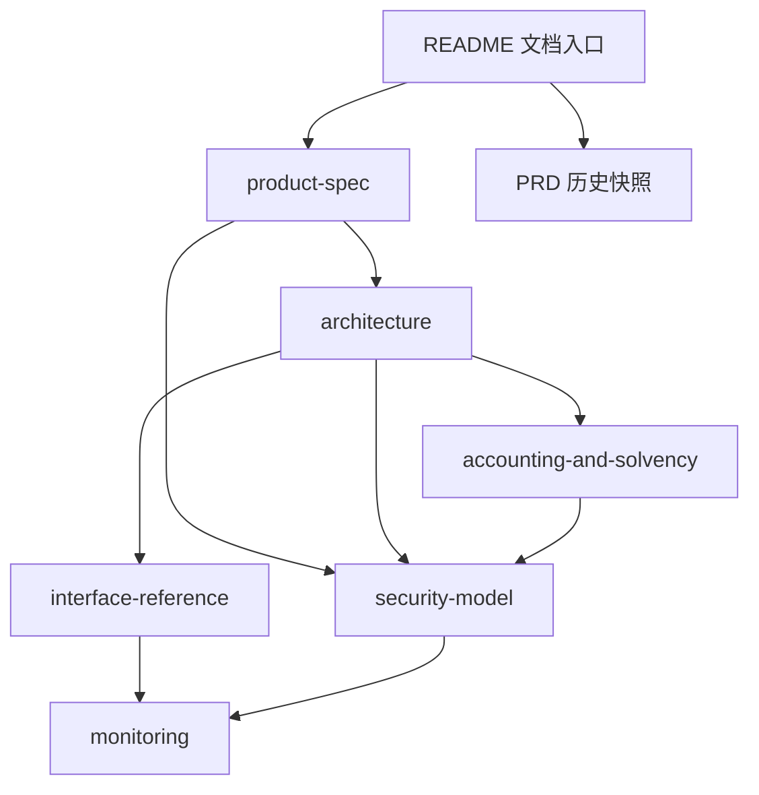

# V2 锁仓推荐质押池文档索引

本目录描述 V2 锁仓推荐质押池已经确立的产品行为与技术约束。当前文档体系从单体 PRD 拆分而来，拆分只调整内容归属、叙述顺序和交叉引用，不改变既有功能、公式、接口或事件语义。

## 1. 文档基线

- [`PRD_V2_Staking.md`](../PRD_V2_Staking.md) 是拆分前的历史功能快照，保留用于追溯，不再作为后续修改入口。
- 本页及下列模块化文档是当前维护入口。
- 若模块化文档与历史快照出现语义差异，应先按历史快照确认原决定，再判断是迁移遗漏还是需要新的产品决策；不得在技术文档中静默改变产品行为。

## 2. 文档地图

| 文档 | 负责内容 | 不负责内容 |
| --- | --- | --- |
| [`product-spec.md`](./product-spec.md) | 产品目标、参与者、术语、产品规则、用户流程、控制权与退出行为 | 存储字段、算法步骤、ABI 完整清单 |
| [`architecture.md`](./architecture.md) | 系统边界、模块职责、状态所有权、数据流、状态转换、快照与结算机制 | 产品目标、完整资金公式、风险处置 |
| [`accounting-and-solvency.md`](./accounting-and-solvency.md) | 资金桶、累计量、负债、不变量、取整、奖励注入与安全提取 | 用户交互叙述、完整接口清单 |
| [`interface-reference.md`](./interface-reference.md) | 构造参数、用户/管理员/视图接口、事件签名及调用语义 | 业务动机、监控阈值、攻击分析 |
| [`security-model.md`](./security-model.md) | 资产、角色、信任边界、攻击路径、防护、失败边界与剩余风险 | ABI 重复定义、运营告警流程 |
| [`monitoring.md`](./monitoring.md) | 可观测状态、事件用途、异常条件与上线前监控缺口 | 事件签名的唯一事实源、应急处置流程 |

## 3. 建议阅读顺序

### 3.1 产品与运营

1. [`product-spec.md`](./product-spec.md)
2. [`accounting-and-solvency.md`](./accounting-and-solvency.md)
3. [`monitoring.md`](./monitoring.md)

### 3.2 合约开发与审计

1. [`architecture.md`](./architecture.md)
2. [`accounting-and-solvency.md`](./accounting-and-solvency.md)
3. [`interface-reference.md`](./interface-reference.md)
4. [`security-model.md`](./security-model.md)
5. [`monitoring.md`](./monitoring.md)

### 3.3 前端与索引器

1. [`product-spec.md`](./product-spec.md)
2. [`interface-reference.md`](./interface-reference.md)
3. [`monitoring.md`](./monitoring.md)

## 4. 原文迁移关系

| 历史 PRD 内容 | 当前主要归属 |
| --- | --- |
| 产品概述、奖励术语、用户可见机制 | [`product-spec.md`](./product-spec.md) |
| 资金账户、补贴预算、偿付约束、精度 | [`accounting-and-solvency.md`](./accounting-and-solvency.md) |
| 仓位账本、到期切分、快照插值、内部状态变化 | [`architecture.md`](./architecture.md) |
| Stake、Claim、Withdraw 的用户结果 | [`product-spec.md`](./product-spec.md) |
| Stake、Claim、Withdraw 的技术执行顺序 | [`architecture.md`](./architecture.md) |
| 配置的产品承诺与隐式开关 | [`product-spec.md`](./product-spec.md) |
| 配置存储、角色权限和精度实现 | [`architecture.md`](./architecture.md)、[`accounting-and-solvency.md`](./accounting-and-solvency.md) |
| 安全边界与异常处理 | [`security-model.md`](./security-model.md) |
| 接口和事件签名 | [`interface-reference.md`](./interface-reference.md) |
| 事件、账本和周期状态的运行观测 | [`monitoring.md`](./monitoring.md) |

## 5. 维护规则

1. 同一决定只由一篇文档负责，其他文档使用相对链接引用。
2. 产品行为先在 `product-spec.md` 中确认，再同步到架构、账本、安全、接口和监控文档。
3. 资金公式和不变量只在 `accounting-and-solvency.md` 中定义；其他文档不得另写一套计算口径。
4. 公共函数和事件签名只在 `interface-reference.md` 中完整定义。
5. 新的重大架构权衡应单独记录 ADR；当前拆分不新增或改变任何架构决定。
6. 原始 PRD 仅作历史追溯，不在其中追加模块化文档的新内容。