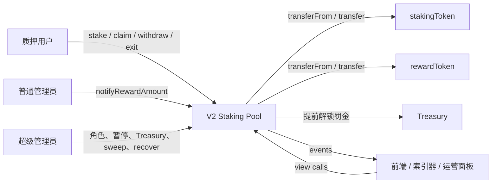
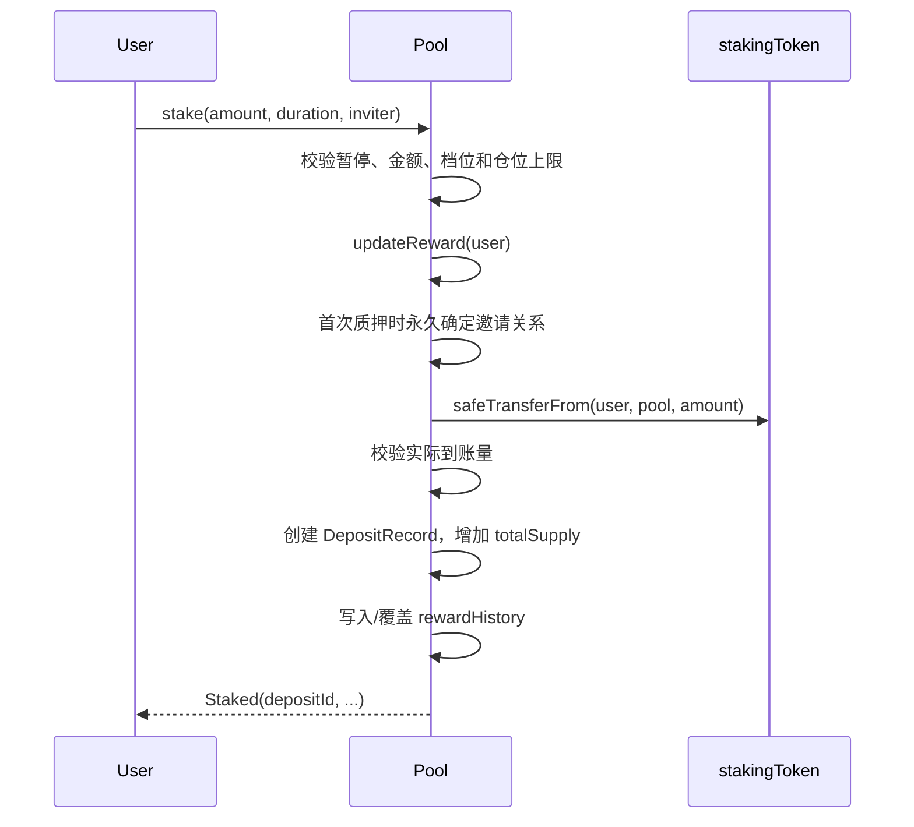

# V2 锁仓推荐质押池架构

## 1. 文档职责

本文档将 [`product-spec.md`](./product-spec.md) 中已经确立的产品行为翻译为系统边界、模块职责、状态所有权、数据流和状态转换。

- 资金不变量与公式由 [`accounting-and-solvency.md`](./accounting-and-solvency.md) 负责。
- 公共 ABI 与事件签名由 [`interface-reference.md`](./interface-reference.md) 负责。
- 攻击路径与安全边界由 [`security-model.md`](./security-model.md) 负责。

## 2. 系统边界

V2 是单合约实例、单活动规则的链上质押池。合约直接持有用户本金、基础奖励和补贴备付金，并通过内部逻辑账本区分资金归属。

当 `stakingToken == rewardToken` 时，图中的两个 Token 节点是同一资产，但本金、基础奖励和补贴仍由不同账本拥有。

## 3. 模块职责

| 模块 | 拥有的状态 | 唯一变更原因 |
| --- | --- | --- |
| 活动配置 | Token、奖励周期、锁仓档位、推荐比例、补贴上限、罚金率 | 构造时一次性建立；Treasury 是唯一可变运行配置 |
| 基础奖励调度 | `rewardRate`、`periodFinish`、`lastUpdateTime`、`rewardPerTokenStored` | 时间推进、供应量变化或追加奖励改变释放曲线 |
| 仓位注册表 | `DepositRecord`、全局 `depositId`、用户活跃仓位 ID | 创建或关闭独立仓位 |
| 到期水位线历史 | `rewardHistory` | 后续全局奖励曲线发生真实折点 |
| 推荐关系 | `hasSetInviter`、`inviterOf` | 用户首次质押时永久定型 |
| 推荐返佣账本 | `referralRewards` | 下级仓位结算新的基础奖励，或上级领取返佣 |
| 资金与偿付账本 | `totalSupply`、`baseRewardReserve`、`subsidyReserve`、累计量和补贴负债 | 本金、奖励和补贴的注入、归属、支付、作废或安全回收 |
| 权限与暂停 | AccessControl、Pausable 状态 | 管理员授权、撤销或紧急限制新增风险 |

模块可以由同一合约实现，但状态必须遵守上述单一所有权，不能通过 ERC20 总余额反推内部资金桶。

## 4. 固定配置与运行状态

### 4.1 部署固定配置

构造函数一次性接收并校验：

- `stakingToken`、`rewardToken`；
- `rewardsDuration`；
- 锁仓档位 `durations[] / boosts[]`；
- `inviteeBoost / level1 / level2 / level3`；
- `maxSubsidyRateCap`；
- `penaltyRate`；
- 初始 `treasury`、管理员地址。

奖励周期、锁仓档位、推荐比例、补贴上限与罚金率部署后不可修改。Treasury 可在运行期由超级管理员更新，不写入仓位，也不影响补贴预算。

### 4.2 隐式开关

- 空 `durations[] / boosts[]` 关闭锁仓模块。
- `inviteeBoost / level1 / level2 / level3` 全为 0 时关闭推荐模块。
- `penaltyRate == 0` 关闭本金罚金，不关闭锁仓与锁仓加速奖励作废规则。
- 活期档位由 `duration == 0` 隐式表达，不进入锁仓档位数组。

构造校验必须保证：

- `rewardsDuration > 0`；
- 核心地址非零；
- `durations.length == boosts.length`，档位数量不超过上限且 duration 不重复；
- 每个 `duration > 0` 的档位都满足 `boostRate > 0`；
- `level2 > 0 ⟹ level1 > 0`，`level3 > 0 ⟹ level2 > 0`；
- `penaltyRate <= BPS`；
- `maxSubsidyRate <= maxSubsidyRateCap`。

## 5. 仓位数据模型

每次 `stake` 生成独立 `DepositRecord`，相同期限也不合并。记录至少包含：

| 字段 | 语义 |
| --- | --- |
| `owner` | 仓位归属；零地址表示 ID 不存在 |
| `amount` | 活跃本金；0 表示仓位已关闭 |
| `unlockTime` | 锁仓到期时间；活期仓位为 0 |
| `boostRate` | 创建时所选档位的锁仓加速比例 |
| `rewardPerTokenPaid` | 该仓位上次结算的独立水位线 |
| `rewardPerTokenAtUnlock` | `unlockTime` 时刻的全局水位线缓存 |
| `boostSettled` | 是否已完成锁仓期与到期后奖励切分 |
| `pendingBaseReward` | 已归属、未支付的基础奖励 |
| `pendingInviteeBoostReward` | 已归属、未支付的自身推荐补贴 |
| `pendingBoostReward` | 已归属、未支付的锁仓加速奖励 |

活期仓位可在创建时把 `boostSettled` 置为 `true`。`rewardPerTokenAtUnlock` 只保存数值，不作为“是否已切分”的状态标记。

### 5.1 活跃仓位索引

- 每个用户只在 `activeDepositIds` 中保存 `amount > 0` 的仓位 ID。
- `MAX_ACTIVE_DEPOSITS = 50`，是合约版本级常量，不是部署参数。
- 关闭仓位时使用 Swap and Pop，以 O(1) 从活跃数组移除。
- 历史仓位记录保留 `owner`，并将 `amount` 置为 0，使视图可区分不存在、活跃和已关闭。

## 6. 推荐关系模型

`hasSetInviter` 与 `inviterOf` 共同表达三种状态：

| `hasSetInviter[user]` | `inviterOf[user]` | 含义 |
| --- | --- | --- |
| `false` | `address(0)` | 尚未首次质押 |
| `true` | `address(0)` | 已永久选择无上级 |
| `true` | 非零地址 | 已永久绑定有效邀请人 |

首次绑定只允许指向已经完成绑定的地址，且不能指向零地址或自己。由于关系只追加、不改写，新节点不可能是既有链路的祖先，邀请图天然形成无环森林，无需运行期向上遍历检测环。

`getUpline(user)` 最多沿 `inviterOf` 返回上三级。三级返佣按部署固定的连续前缀比例自上而下计提，遇到首个 0 比例停止。

## 7. 全局奖励账本同步

所有需要推进奖励状态的写入口先执行等价的全局同步：

1. 计算从 `lastUpdateTime` 到 `lastTimeRewardApplicable()` 的时间区间。
2. 若 `totalSupply > 0`，按当前 `rewardRate` 推进 `rewardPerTokenStored`。
3. 若 `totalSupply == 0`，水位线不增长；该区间基础奖励记为空窗自然流失，并同步相应资金和累计账本。
4. 更新 `lastUpdateTime`。
5. 若指定用户，再遍历其活跃仓位进行逐仓结算。

空窗流失、累计量与补贴负债的精确变化见 [`accounting-and-solvency.md`](./accounting-and-solvency.md)。

## 8. 逐仓奖励结算

对单个仓位结算时：

1. 取得当前全局 `rewardPerToken`。
2. 计算从 `rewardPerTokenPaid` 到当前水位线产生的新增基础奖励。
3. 若首次跨越 `unlockTime`，先通过历史快照还原 `rewardPerTokenAtUnlock`，只将锁仓期内的基础奖励作为锁仓加速计算基数，并将 `boostSettled = true`。
4. 若仍在锁仓期，按仓位 `boostRate` 计提锁仓加速奖励。
5. 若用户绑定有效邀请人，按 `inviteeBoost` 计提自身推荐补贴。
6. 沿上三级邀请链按 `level1 / level2 / level3` 计提用户级推荐返佣。
7. 新增基础奖励加入 `pendingBaseReward`；各类补贴分别进入对应仓位或用户级账本。
8. 更新 `rewardPerTokenPaid`。
9. 将本次新增基础奖励计入累计已消化口径，并在本次用户结算完成后统一重算未结算最大补贴负债。

锁仓加速、自身推荐补贴和三级返佣分别基于新增基础奖励独立向下取整，不互相复利。

## 9. 到期水位线快照

### 9.1 快照结构

`rewardHistory` 的每条记录至少包含：

- `time`：真实 `block.timestamp`；
- `rewardPerToken`：该时刻已结算的全局水位线；
- `periodFinish`：从该时刻向后生效的奖励周期结束时间。

### 9.2 写入边界

只在会改变后续全局奖励曲线的入口写入或覆盖快照：

- `stake`；
- `withdraw` / `withdrawMultiple`；
- `notifyRewardAmount`。

`claimAll` 不改变 `totalSupply`、`rewardRate` 或 `periodFinish`，不得仅因奖励结算写入快照。到期切分本身也不改变全局奖励曲线，不强制写快照。

各入口顺序：

- `stake`：先按旧 `totalSupply` 结算，再增加供应量，最后写入新曲线折点。
- `withdraw` / `withdrawMultiple`：先结算，关闭仓位并减少供应量，最后写入新曲线折点。
- `notifyRewardAmount`：先按旧曲线结算，计算并启用新调度，再写入代表新曲线的折点。

同一 `block.timestamp` 已存在最后一条快照时，覆盖其 `rewardPerToken` 与 `periodFinish`，不增加数组长度。覆盖后的记录必须代表该时间戳最后一次状态变化后的奖励曲线。

### 9.3 二分查找与插值

首次跨越到期点时，在 `rewardHistory` 中查找：

- `cp1`：满足 `time <= unlockTime` 的最后一条快照；
- `cp2`：`cp1` 右侧第一条快照。

若直接命中 `cp1.time == unlockTime`，返回 `cp1.rewardPerToken`。

若没有右侧真实快照，使用“虚拟当前节点”作为 `cp2`：

- 写路径使用本次已经结算的 `rewardPerTokenStored`；
- 只读路径使用当前 `rewardPerToken()`；
- 虚拟节点只参与本次计算，不写入 `rewardHistory`。

插值必须按 `cp1.periodFinish` 截断：

\[
effectiveUnlockTime = \min(unlockTime, cp1.periodFinish)
\]

\[
effectiveCp2Time = \min(cp2.time, cp1.periodFinish)
\]

\[
rewardPerTokenAtUnlock = cp1.reward +
\frac{(cp2.reward-cp1.reward)\times(effectiveUnlockTime-cp1.time)}
{effectiveCp2Time-cp1.time}
\]

若 `effectiveCp2Time <= cp1.time`，从 `cp1` 起已无奖励继续释放，直接返回 `cp1.reward`。

### 9.4 查找边界

- `unlockTime <= 第一条快照.time`：返回第一条快照水位线。正常锁仓仓位不应进入该分支，因为创建仓位时会写入 `stakeTime <= unlockTime` 的快照。
- `rewardHistory` 为空：返回当前 `rewardPerTokenStored`。
- 命中相同时间戳：直接返回快照值，不执行插值，避免除零。
- V2 不裁剪历史快照。存储增长通过限定写入口、同区块覆盖和 `claimAll` 不落盘控制。

## 10. 核心调用流

### 10.1 Stake

非首次质押忽略 `inviter` 参数。锁仓选择还需满足 `isRewardPeriodActive()`；活期选择不受奖励周期状态限制。

### 10.2 ClaimAll

1. `updateReward(user)` 遍历全部活跃仓位。
2. 汇总各仓位 `pendingBaseReward`、`pendingInviteeBoostReward` 和已解锁 `pendingBoostReward`。
3. 加入用户级 `referralRewards[user]`。
4. 先清零相应状态并更新基础奖励、补贴现金与负债账本。
5. 聚合转账给用户。
6. 按奖励类型抛出支付事件，并可保留聚合 `RewardPaid` 兼容事件。

`claimAll` 不支付尚未到期或尚未完成到期切分的锁仓加速奖励，也不写 `rewardHistory`。

### 10.3 Withdraw / WithdrawMultiple

单笔和批量提取共享同一仓位关闭流程：

1. 批量入口先检查数组非空和长度上限。
2. 对调用者只执行一次 `updateReward`，统一结算全部活跃仓位。
3. 逐个校验仓位存在、归属调用者、尚未关闭且 ID 不重复。
4. 在关闭前支付该仓位基础奖励和自身推荐补贴；到期仓位同时支付已解锁锁仓加速奖励。
5. 提前关闭时计算罚金并作废未解锁锁仓加速奖励。
6. 将 `amount` 置 0，减少 `totalSupply`，从活跃数组移除。
7. 内存中分别聚合 `principalToUser`、`penaltyToTreasury`、`baseRewardToUser`、`inviteeBoostToUser` 和 `unlockedBoostToUser`，完成全部状态更新后再执行必要的 Token 转账。
8. 每个 `depositId` 分别抛出关闭相关事件。
9. 全部仓位处理完成后写入或覆盖当前时间戳快照。

批量提取采用全有或全无语义。任一 ID 无效、重复或不属于调用者时，整笔交易回退。

### 10.4 NotifyRewardAmount

1. 校验调用者角色、暂停状态和 `baseRewardAmount > 0`。
2. 同步旧奖励曲线及可能存在的空窗自然流失。
3. 通过余额差取得本次实际注入基础奖励；实际到账必须等于输入。
4. 计算新基础奖励调度、累计注入预算、可复用沉淀补贴和本次需补缴补贴。
5. 需要补缴时，从管理员收取补贴并校验实际到账。
6. 更新基础奖励、补贴现金和未结算最大补贴负债账本。
7. 启用新的 `rewardRate / periodFinish`。
8. 写入或覆盖代表新曲线的快照。

若新调度总额除以 `rewardsDuration` 后无法形成非零 `rewardRate`，必须在资金永久进入活动账本前回退。

### 10.5 SweepSubsidy

1. 超级管理员调用且合约未暂停。
2. 先执行全局奖励账本同步；只在空池场景释放已确认自然流失对应的潜在补贴预算。
3. 按同步后的逻辑账本计算 `maxSweepableSubsidy()`。
4. 校验 `amount` 后只减少 `subsidyReserve` 并转账，不改用户待领状态。

### 10.6 SweepExpiredBaseReward

1. 超级管理员调用且合约未暂停。
2. 要求奖励周期结束、`totalSupply == 0`、接收地址非零且 `baseRewardReserve > 0`。
3. 先同步全局账本。
4. 一次性回收全部 `baseRewardReserve`，并把该金额计入累计已消化基础奖励。
5. 重算未结算最大补贴负债；不改变 `subsidyReserve` 或 `totalPendingSubsidy`。

## 11. 角色与暂停控制

- 超级管理员拥有角色分配、Treasury 更新、暂停/恢复、补贴提取、过期基础奖励回收和非核心 Token 救援权限。
- 普通管理员拥有 `notifyRewardAmount` 权限。
- 暂停阻断 `stake`、`notifyRewardAmount`、`sweepSubsidy`、`sweepExpiredBaseReward`。
- 暂停继续放行用户退出和领奖，以及 `recoverERC20` 与紧急 `setTreasury`。
- 暂停不修改时间、`periodFinish`、`unlockTime` 或奖励累计逻辑。

## 12. Token 转账边界

- 所有 Token 操作使用安全转账封装。
- `stake`、基础奖励注入和补贴补缴分别就地记录转账前后余额差。
- 实际到账与输入不一致时回退 `FeeOnTransferNotSupported()`；V2 不按实际到账量降级记账。
- 同币池每次转账仍只归属本入口对应的逻辑资金桶，不使用跨入口全局余额快照。
- `recoverERC20` 禁止 `stakingToken` 和 `rewardToken`；核心资金只能通过对应业务入口转出。

## 13. 只读投影

视图函数不得修改状态，但展示结果必须与下一次写入结算一致：

- 已到期但 `boostSettled == false` 的仓位，`earned` 和 `earnedByDeposit` 在内存中使用虚拟当前快照计算到期水位线。
- `maxSweepableSubsidy()` 在 `totalSupply == 0` 时，临时投影全局同步后的空窗流失和潜在负债。
- `getDeposit` 保留历史仓位语义；`getUserDeposits` 只返回当前活跃仓位。
- `inviterOf == address(0)` 必须结合 `hasSetInviter` 解读。

完整返回语义见 [`interface-reference.md`](./interface-reference.md)。

## 14. 已接受的技术约束

- 用户级奖励更新需要遍历最多 50 个活跃仓位。
- `rewardHistory` 随真实曲线折点长期增长，V2 不提供裁剪。
- 同一活动池不可修改经济参数；变更规则需要部署新实例。
- 合约只支持标准 ERC20 余额语义。
- 推荐深度固定为三级，且采用记账后由受益人主动领取，不在下级结算时直接转账。