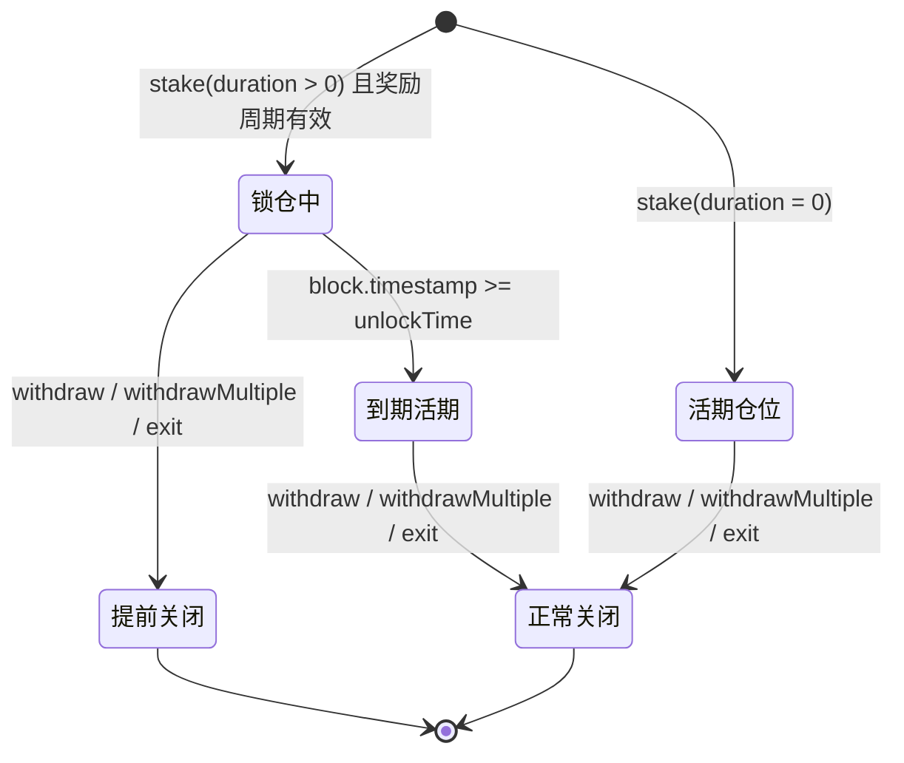

# V2 锁仓推荐质押池产品规格

## 1. 文档职责

本文档说明 V2 为参与者提供什么能力、用户会观察到什么行为，以及活动池运行期间哪些产品承诺保持不变。

以下内容由其他文档负责：

- 状态字段、结算顺序和历史水位线算法见 [`architecture.md`](./architecture.md)。
- 资金桶、补贴预算、偿付不变量和取整公式见 [`accounting-and-solvency.md`](./accounting-and-solvency.md)。
- 完整函数与事件契约见 [`interface-reference.md`](./interface-reference.md)。
- 攻击路径和异常边界见 [`security-model.md`](./security-model.md)。

## 2. 产品基调

### 2.1 业务背景

V1 是无锁仓、随存随取的标准双币质押收益池。V2 在 V1 基础水位线奖励之上增加三类能力：

1. **锁仓奖励加速（Lock-up Boost）**：以锁仓承诺换取额外奖励。
2. **提前解锁惩罚（Early Unlock Penalty）**：允许提前退出，但增加退出成本并作废未解锁的锁仓加速奖励。
3. **三级推荐返佣（3-Level Referral）**：由平台额外补贴被邀请人及其上三级邀请人，不从下级本金或基础奖励中扣除。

V2 解决活期质押难以形成长期资金留存、缺少链上推荐增长机制，以及额外补贴支出难以提前约束三个问题。

### 2.2 核心目标

- **长期留存**：锁仓时间越长，可配置的奖励加速比例越高；提前退出可能扣除本金。
- **推荐增长**：有效邀请关系同时为被邀请人和上级提供额外补贴。
- **资金预算约束**：通过补贴备付金覆盖已确认补贴负债和尚未结算的最大理论补贴预算。

### 2.3 适用场景

每个合约实例代表一个部署时配置、运行期经济规则固定的活动池，可用于：

- 平台币或社区代币的长期质押激励；
- 新币挖矿或 Launchpool 冷启动；
- 联合营销和 Partner Airdrops。

### 2.4 部署模式

V2 同时支持：

- **异币池**：`stakingToken != rewardToken`；
- **同币池**：`stakingToken == rewardToken`。

同币池中本金、基础奖励、补贴备付金和罚金处理中间余额可能共享同一 ERC20 余额，但产品仍承诺这些资金归属互不挪用。具体账本口径见 [`accounting-and-solvency.md`](./accounting-and-solvency.md)。

## 3. 参与者与控制权

### 3.1 质押用户

用户可以创建独立仓位、领取奖励、关闭单个或多个仓位，并在前端不可用时直接调用合约退出。单笔仓位只支持全额关闭，不支持部分提取。

### 3.2 邀请人与被邀请人

用户首次质押时永久确定邀请状态。有效邀请关系建立后：

- 被邀请人可以获得自身推荐补贴；
- 直接邀请人及其上两级可以按池级配置获得推荐返佣；
- 推荐返佣来自平台补贴，不减少被邀请人的本金或基础奖励。

### 3.3 普通管理员（Operator）

普通管理员负责活动的日常奖励注入，即调用 `notifyRewardAmount`。该角色不能改变部署时已经承诺的经济参数。

### 3.4 超级管理员（Super Admin / Owner）

超级管理员负责系统级安全操作，包括角色管理、Treasury 地址维护、暂停与恢复、沉淀补贴安全提取、过期基础奖励回收和非核心误转资产救援。其操作边界见 [`security-model.md`](./security-model.md)。

### 3.5 Treasury

Treasury 接收用户提前解锁时扣除的本金罚金。项目方可自行决定后续用途；若希望重新分配给质押者，必须通过一次新的 `notifyRewardAmount` 将资金重新纳入基础奖励释放曲线。

## 4. 产品术语

### 4.1 奖励类型

- **基础奖励（Base Reward）**：基础奖池按 V1 水位线模型线性释放，并按当前质押份额分配的奖励。所有额外补贴都以基础奖励为计算基准。
- **锁仓加速奖励（Lock Boost Reward）**：锁仓期内按仓位 `boostRate` 基于基础奖励额外计提的补贴；到期前只记账，到期切分完成后才可领取。
- **自身推荐补贴（Invitee Boost Reward）**：绑定有效邀请人的用户基于自身基础奖励获得的额外补贴。
- **推荐返佣（Referral Reward）**：用户上三级邀请人基于该用户基础奖励获得的返佣。
- **罚金（Penalty）**：锁仓仓位提前关闭时，从该仓位本金中按 `penaltyRate` 扣除并转入 Treasury 的金额。

锁仓加速奖励、自身推荐补贴和三级推荐返佣分别基于基础奖励独立计算，互不叠加，不产生复利。

### 4.2 有效基础奖励释放周期

`isRewardPeriodActive()` 当且仅当以下条件同时成立时返回 `true`：

- `rewardRate > 0`；
- `block.timestamp < periodFinish`。

该状态只决定是否允许创建新的锁仓仓位，不改变历史仓位。

## 5. 仓位与奖励生命周期

### 5.1 独立仓位

用户每次质押都会生成独立 `depositId`，即使锁仓期限相同也不合并。每笔仓位独立记录本金、到期时间、锁仓加速比例和待领奖励。

单个用户最多持有 `MAX_ACTIVE_DEPOSITS = 50` 个活跃仓位。达到上限后必须先关闭仓位再创建新仓位。

### 5.2 活期仓位

- `duration == 0` 表示活期。
- `unlockTime == 0`，`boostRate == 0`。
- 任何时候关闭都不属于提前解锁，不产生罚金。
- 首次奖励注入前和奖励周期间空窗仍可创建活期仓位；没有基础奖励释放时不会产生奖励或补贴。

### 5.3 锁仓仓位

- `duration > 0` 表示锁仓。
- 只有 `isRewardPeriodActive() == true` 时才能创建。
- 选择必须匹配部署时配置的锁仓档位。
- 锁仓期内，仓位产生基础奖励，并按档位 `boostRate` 计提锁仓加速奖励。

### 5.4 到期降级

仓位到达 `unlockTime` 后不会自动关闭：

- 本金继续留在池中并参与基础奖励分配；
- 锁仓加速奖励停止新增；
- 已解锁的锁仓加速奖励可通过 `claimAll` 或关闭仓位领取；
- 若用户希望继续获得锁仓加速，必须先关闭仓位，再创建新仓位。

### 5.5 锁仓期超过当前奖励周期

创建锁仓仓位时，只要求当前处于有效基础奖励释放周期，不要求锁仓期短于当前周期剩余时间：

- 当前周期结束且未续奖时，后续基础奖励和额外补贴为 0；
- 到期前追加基础奖励时，剩余锁仓期继续按该仓位原有 `boostRate` 计提锁仓加速奖励；
- 前端应提示超出当前奖励周期的锁仓时间可能没有奖励，但不得阻断用户选择。

## 6. 推荐关系生命周期

### 6.1 首次质押永久定型

合约使用 `hasSetInviter` 区分“尚未首次质押”和“已经永久确定邀请状态”。用户首次质押时：

- 传入 `address(0)`：永久记录为“无上级”；
- 传入满足条件的邀请人：永久绑定该邀请人；
- 传入非零但无效的邀请人：交易回退。

首次质押完成后，追加质押、全部退出后再次质押都不能修改或补填邀请人。后续 `stake` 传入的邀请人参数被忽略。

### 6.2 有效邀请人

邀请人必须同时满足：

- 已完成自己的首次质押绑定，即 `hasSetInviter[inviter] == true`；
- 不是零地址；
- 不是用户本人。

冷启动阶段若不存在已完成首次质押绑定的邀请人，首批用户只能以“无上级”身份完成首次质押。

邀请关系形成 append-only 森林：每个地址只绑定一次，`inviterOf` 绑定后不可修改，且新用户只能绑定已经完成绑定的地址，因此现有规则下不会形成环。

### 6.3 补贴归属

- 用户绑定有效邀请人且 `inviteeBoost > 0` 时，每次基础奖励结算都会产生自身推荐补贴。
- 上三级邀请人按 `level1`、`level2`、`level3` 分别获得推荐返佣。
- 推荐返佣保存在邀请人的用户级账本中；即使邀请人已关闭全部本金仓位，历史返佣仍可通过 `claimAll` 领取。

## 7. 用户流程

### 7.1 创建仓位

用户调用 `stake(amount, lockDuration, inviter)`：

1. 选择活期或已配置的锁仓档位。
2. 锁仓选择必须处于有效基础奖励释放周期；活期不受该限制。
3. 首次质押时永久确定邀请状态。
4. 合约收取本金并创建新的独立仓位。
5. 用户获得全局唯一的 `depositId`。

`amount` 必须大于 0。实际到账数量必须与传入数量一致，不支持 fee-on-transfer 代币。

### 7.2 领取奖励

主动领奖只提供 `claimAll()`。一次调用领取：

- 所有活跃仓位的可领基础奖励；
- 所有活跃仓位的自身推荐补贴；
- 已到期并完成到期切分的锁仓加速奖励；
- 用户级推荐返佣。

未到期锁仓仓位的锁仓加速奖励只记账，不会被 `claimAll` 支付。

### 7.3 关闭单个或多个仓位

- `withdraw(depositId)`：关闭指定仓位。
- `withdrawMultiple(depositIds)`：原子化关闭多个仓位。
- 单笔仓位必须全额关闭，不支持部分提取。
- 批量提取全有或全无；数组不能为空，不得包含无效、非本人、已关闭或重复的 `depositId`，长度不得超过批量上限。

关闭前，仓位内的基础奖励和自身推荐补贴必须结清，禁止奖励遗留在已关闭仓位中。到期锁仓仓位还会结清已解锁但未领取的锁仓加速奖励。

### 7.4 正常到期关闭

活期仓位或已经到期的锁仓仓位关闭时：

- 退还全额本金；
- 支付该仓位尚未领取的基础奖励和自身推荐补贴；
- 已到期锁仓仓位同时支付尚未领取的锁仓加速奖励。

### 7.5 提前关闭

`block.timestamp < unlockTime` 时关闭锁仓仓位属于提前解锁：

- 罚金为 `floor(amount * penaltyRate / BPS)`，实时转入 Treasury；
- 用户收到扣除罚金后的本金；
- 该仓位尚未解锁的锁仓加速奖励全部作废；
- 基础奖励和自身推荐补贴不受影响，仍在关闭前支付。

当 `penaltyRate == 0` 时，提前关闭不扣本金，但未解锁的锁仓加速奖励仍然作废。当 `penaltyRate == BPS` 时，罚金等于全部本金，用户本金退还额为 0。

### 7.6 一键退出

`exit()` 关闭用户全部活跃仓位并领取全部可领奖励。用户没有活跃仓位但仍有可领奖励或推荐返佣时，`exit()` 不得因零本金而失败。

## 8. 活动配置承诺

### 8.1 部署时固定的经济规则

每个合约实例是独立活动池。以下配置在部署时一次性确定，合约生命周期内不可修改：

- 奖励周期 `rewardsDuration`；
- 锁仓档位 `durations[] / boosts[]`；
- 自身推荐补贴 `inviteeBoost`；
- 三级返佣比例 `level1 / level2 / level3`；
- 最大额外补贴预算上限 `maxSubsidyRateCap`；
- 罚金率 `penaltyRate`。

若需要不同经济规则，应部署新的活动池。Treasury 地址属于运行期安全配置，不属于固定经济规则，可由超级管理员修改。

### 8.2 锁仓模块开关

- `durations = []` 且 `boosts = []`：关闭锁仓模块，只允许活期仓位。
- 非空档位中，`duration > 0` 必须对应 `boostRate > 0`；不允许用户承担锁仓约束却没有锁仓加速收益。
- `durations.length` 必须等于 `boosts.length`，档位数量不得超过上限，`duration` 不得重复。
- 活期档位由系统隐式支持，不要求管理员显式配置。

### 8.3 推荐模块开关

- `inviteeBoost == 0 && level1 == 0 && level2 == 0 && level3 == 0`：推荐模块完全关闭。
- 三级返佣必须构成从 L1 开始的连续前缀：`level2 > 0` 要求 `level1 > 0`，`level3 > 0` 要求 `level2 > 0`。
- 合法形态包括仅一级、仅两级、完整三级，以及不启用上级返佣但只启用 `inviteeBoost` 的 `boost-only` 形态。
- 禁止跳级空洞配置；部署时必须回退 `InvalidReferralRateConfig`。
- `inviteeBoost` 与三级返佣相互独立，不互相强制。

### 8.4 罚金模块开关

- `penaltyRate == 0`：提前解锁不扣本金，但锁仓模块仍可启用，未解锁的锁仓加速奖励仍会作废。
- `penaltyRate <= BPS`；不得超过 100%。
- 锁仓档位为空时，系统不存在提前解锁场景，罚金逻辑不会作用于活期仓位。

### 8.5 补贴预算上限

部署时按以下规则得到最大理论额外补贴率：

`maxSubsidyRate = inviteeBoost + level1 + level2 + level3 + max(boosts[])`

锁仓档位为空时，`max(boosts[])` 按 0 处理。构造函数必须保证 `maxSubsidyRate <= maxSubsidyRateCap`。两者部署后均不可修改。

完整资金计算和累计取整规则见 [`accounting-and-solvency.md`](./accounting-and-solvency.md)。

## 9. 奖励周期与空窗行为

- 用户可以在首次 `notifyRewardAmount` 前创建活期仓位，但不能创建锁仓仓位。
- `notifyRewardAmount` 后奖励周期立即启动，即使当前 `totalSupply == 0`。
- `totalSupply == 0` 期间，`rewardPerToken` 不增长，释放的基础奖励不归属后续首个用户，视为自然流失。
- 奖励周期结束、池内无活跃本金且仍有 `baseRewardReserve` 时，超级管理员可以一次性回收全部过期基础奖励；不支持部分回收。

## 10. 暂停期间的用户行为

暂停只限制新增风险，不冻结时间、奖励周期或仓位到期时间。

暂停时阻断：

- `stake`；
- `notifyRewardAmount`；
- `sweepSubsidy`；
- `sweepExpiredBaseReward`。

暂停时仍允许：

- `withdraw`、`withdrawMultiple`、`claimAll`、`exit`，保障用户退出；
- `recoverERC20`，救援非核心误转资产；
- `setTreasury`，修复罚金接收地址。

## 11. 明确边界

- 只支持标准 ERC20 余额语义，不支持 fee-on-transfer、rebasing、黑名单冻结、回调型或其他改变实际到账/支付语义的代币。
- V2 不合并相同期限仓位，也不支持部分提取。
- V2 不自动续锁；到期后仓位降级为只产生基础奖励的活期状态。
- V2 不允许运行期修改经济参数；新规则通过部署新活动池实现。
- V2 不提供 `rewardHistory` 裁剪能力。
- 多级推荐的目标市场、宣传方式和法律定性不由现有功能规格确认；相关结论需要按实际运营地区另行评估。